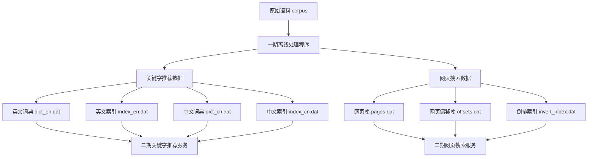
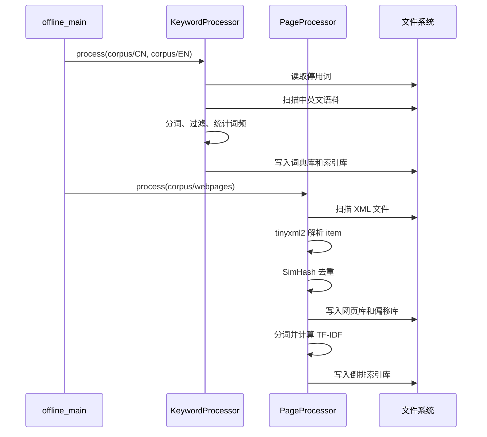
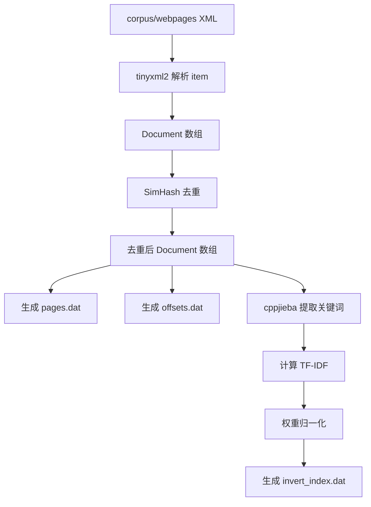
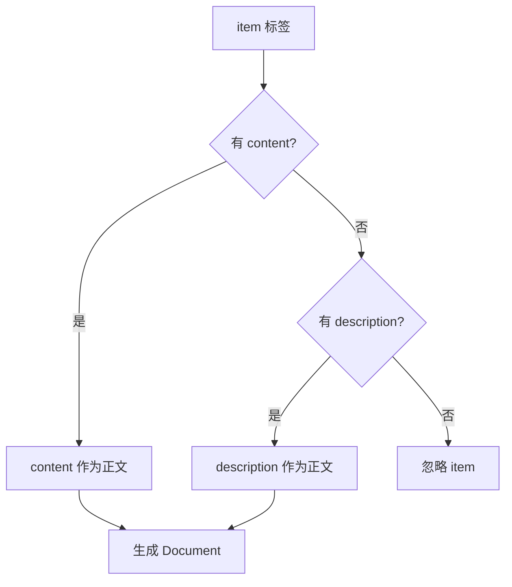
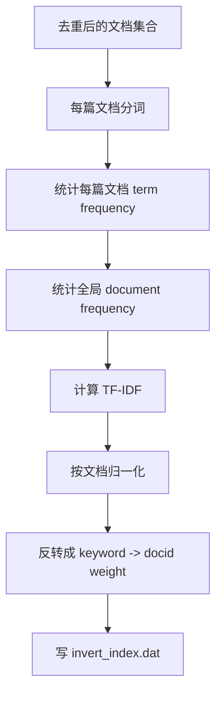
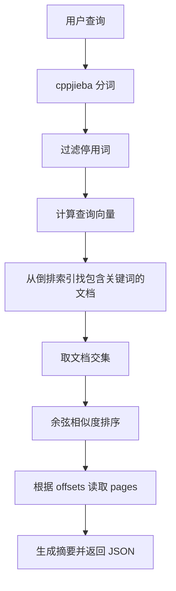
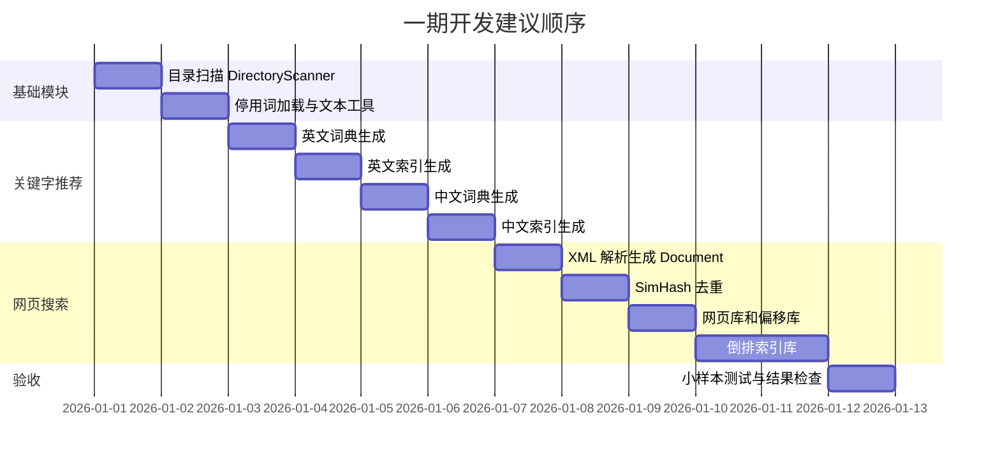

# 搜索引擎项目第一期开发思路

## 1. 一期目标总览

第一期是整个搜索引擎项目的“离线建库阶段”。它不直接处理网络请求，而是把原始语料加工成二期服务器可以快速查询的数据文件。

从 PDF 第 1 到 13 页可以看出，一期要完成两条主线：

1. 关键字推荐离线部分：根据中英文语料库和停用词生成词典库、索引库。
2. 网页搜索离线部分：根据网页 XML 语料生成网页库、网页偏移库、倒排索引库。

评分标准中“一期和二期功能实现”占 60 分，所以一期的重点不是写出复杂框架，而是保证离线数据格式正确、算法过程完整、文件可被二期稳定加载。



## 2. 推荐目录结构

项目可以按下面的结构组织。命名不必完全一致，但建议把“输入语料、配置、离线生成结果、源码”分清楚。

```text
NutShell-Search/
├── bin
├── build
├── CMakeLists.txt
├── conf
│   └── config.conf
├── data
│   ├── corpus
│   │   ├── CN
│   │   ├── EN
│   │   └── webpages
│   ├── dict
│   ├── index
│   └── stopwords
├── docs
├── include
│   ├── common
│   ├── offline
│   └── online
├── LICENSE
├── README.md
├── src
│   ├── common
│   ├── offline
│   └── online
└── tests
```

`data/` 目录是一期最终交付的核心产物。二期服务器启动后，只需要加载这些文件，不应该再扫描原始语料。

## 3. 一期程序总体流程

一期可以写成一个离线可执行程序，例如 `offline_main`。运行后按顺序执行关键字推荐建库和网页搜索建库。



建议入口函数保持简单：

```cpp
int main()
{
    KeywordProcessor keywordProcessor;
    keywordProcessor.process("corpus/CN", "corpus/EN");

    PageProcessor pageProcessor;
    pageProcessor.process("corpus/webpages");

    return 0;
}
```

## 4. 公共模块设计

### 4.1 DirectoryScanner

PDF 中明确要求使用目录流 `opendir()`、`readdir()`、`closedir()` 读取目录。这个逻辑会被中英文语料和网页 XML 语料共同使用，所以适合抽成公共类。

```cpp
#pragma once
#include <string>
#include <vector>

class DirectoryScanner
{
public:
    static std::vector<std::string> scan(const std::string& dir);

private:
    DirectoryScanner() = delete;
};
```

实现要点：

1. 跳过 `.` 和 `..`。
2. 返回完整路径，而不是只返回文件名，后续打开文件会更方便。
3. 可以按文件名排序，保证多次运行生成结果稳定。
4. 遇到目录打开失败时输出错误日志或抛异常，不要静默失败。

示例实现思路：

```cpp
std::vector<std::string> DirectoryScanner::scan(const std::string& dir)
{
    std::vector<std::string> files;
    DIR* dp = opendir(dir.c_str());
    if (!dp) {
        throw std::runtime_error("opendir failed: " + dir);
    }

    while (dirent* entry = readdir(dp)) {
        std::string name = entry->d_name;
        if (name == "." || name == "..") {
            continue;
        }
        files.push_back(dir + "/" + name);
    }

    closedir(dp);
    std::sort(files.begin(), files.end());
    return files;
}
```

### 4.2 停用词加载

停用词用于过滤高频但信息量低的词，例如英文中的 `the`、`is`，中文中的 `的`、`了`。建议加载到 `std::unordered_set<std::string>` 或 `std::set<std::string>`。

`unordered_set` 查询平均复杂度是 O(1)，更适合频繁判断；`set` 有序，调试输出更稳定。课程 PDF 示例使用 `set`，如果想保持简单，可以先用 `set`。

```cpp
std::set<std::string> load_stop_words(const std::string& filename)
{
    std::set<std::string> words;
    std::ifstream ifs(filename);
    std::string word;
    while (ifs >> word) {
        words.insert(word);
    }
    return words;
}
```

### 4.3 文本工具函数

推荐把容易复用的小函数放在 `TextUtils` 中：

```cpp
namespace TextUtils {
bool is_ascii_alpha(char ch);
std::string normalize_english_line(const std::string& line);
std::vector<std::string> split_utf8_characters(const std::string& word);
bool is_chinese_punctuation_or_space(const std::string& token);
}
```

不要把所有逻辑都塞进工具类。工具函数只处理“无状态、通用”的事情，建库流程仍然放在 `KeywordProcessor` 和 `PageProcessor` 中。

## 5. 关键字推荐离线建库

### 5.1 目标产物

关键字推荐需要生成四个文件：

```text
data/dict_en.dat
data/index_en.dat
data/dict_cn.dat
data/index_cn.dat
```

词典库保存“词语和词频”。推荐格式：

```text
词语 词频
```

示例：

```text
computer 153
science 89
搜索 27
引擎 18
```

索引库保存“单个字符到词典行号的映射”。推荐格式：

```text
字符 行号1 行号2 行号3 ...
```

示例：

```text
c 1 7 9 13
o 1 2 8 10
搜 120 301 415
索 120 502
```

注意：这里的“行号”建议从 `1` 开始，与 PDF 示例一致。二期加载时要保持同一约定。

### 5.2 KeywordProcessor 类设计

```cpp
#pragma once
#include <cppjieba/Jieba.hpp>
#include <map>
#include <set>
#include <string>
#include <vector>

class KeywordProcessor
{
public:
    KeywordProcessor();
    void process(const std::string& cnDir, const std::string& enDir);

private:
    void create_cn_dict(const std::string& dir, const std::string& outfile);
    void build_cn_index(const std::string& dict, const std::string& index);

    void create_en_dict(const std::string& dir, const std::string& outfile);
    void build_en_index(const std::string& dict, const std::string& index);

private:
    cppjieba::Jieba tokenizer_;
    std::set<std::string> enStopWords_;
    std::set<std::string> cnStopWords_;
};
```

构造函数中加载停用词，并初始化 `cppjieba::Jieba`。Jieba 初始化会读取词典文件，比较耗时，所以整个类中只维护一个 `tokenizer_` 对象。

### 5.3 英文词典库生成

英文处理规则来自 PDF：

1. 打开 `corpus/EN` 目录，读取所有语料文件。
2. 将数字和标点替换为空格，只保留字母。
3. 字母统一转成小写。
4. 按空白字符分割。
5. 过滤停用词。
6. 统计每个 token 的词频。
7. 写入 `dict_en.dat`。


英文归一化示例：

```cpp
std::string normalize_english_line(const std::string& line)
{
    std::string result;
    result.reserve(line.size());

    for (unsigned char ch : line) {
        if (std::isalpha(ch)) {
            result.push_back(static_cast<char>(std::tolower(ch)));
        } else {
            result.push_back(' ');
        }
    }
    return result;
}
```

词频统计示例：

```cpp
std::map<std::string, int> freq;
for (const auto& file : DirectoryScanner::scan(dir)) {
    std::ifstream ifs(file);
    std::string line;
    while (std::getline(ifs, line)) {
        std::string normalized = normalize_english_line(line);
        std::istringstream iss(normalized);
        std::string word;
        while (iss >> word) {
            if (enStopWords_.count(word) == 0) {
                ++freq[word];
            }
        }
    }
}
```

### 5.4 中文词典库生成

中文处理规则来自 PDF：

1. 打开 `corpus/CN` 目录，读取所有语料文件。
2. 使用 `cppjieba` 分词，建议使用 Mix 模式，也就是 `tokenizer_.Cut(text, words)`。
3. 过滤停用词。
4. 过滤空白、标点、纯数字等无意义 token。
5. 统计词频。
6. 写入 `dict_cn.dat`。


Jieba 使用示例：

```cpp
std::vector<std::string> words;
tokenizer_.Cut(text, words); // Mix 模式

for (const auto& word : words) {
    if (word.empty()) {
        continue;
    }
    if (cnStopWords_.count(word) != 0) {
        continue;
    }
    if (is_useless_cn_token(word)) {
        continue;
    }
    ++freq[word];
}
```

中文 token 过滤不要过度复杂。一期可以先做到：停用词过滤、空白过滤、常见中文标点过滤。只要输出词典质量稳定即可。

### 5.5 英文索引库生成

英文索引库的核心是：遍历词典中的每个单词，把单词中出现过的每个字母映射到该单词所在的词典行号。

例如词典：

```text
1 computer 153
2 compile 31
3 search 42
```

索引应该类似：

```text
c 1 2 3
o 1 2
m 1 2
p 1 2
u 1
t 1
e 1 2 3
r 1 3
```

一个词里同一个字符可能出现多次，例如 `computer` 里没有重复，但 `letter` 有两个 `t`。索引中同一行号只需要保存一次，所以应该先对单词字符去重。

```cpp
std::map<char, std::set<int>> index;
std::string word;
int freq = 0;
int lineNo = 0;

while (ifs >> word >> freq) {
    ++lineNo;
    std::set<char> chars(word.begin(), word.end());
    for (char ch : chars) {
        index[ch].insert(lineNo);
    }
}
```

### 5.6 中文索引库生成

中文索引库与英文索引库类似，但中文字符是 UTF-8 多字节字符，不能用 `word[i]` 按字节切分。PDF 要求使用 `utfcpp` 拆分出一个一个汉字。

```cpp
std::vector<std::string> split_utf8_characters(const std::string& word)
{
    std::vector<std::string> chars;
    const char* curr = word.c_str();
    const char* end = word.c_str() + word.size();

    while (curr != end) {
        const char* start = curr;
        utf8::next(curr, end);
        chars.emplace_back(start, curr);
    }
    return chars;
}
```

中文索引构建：

```cpp
std::map<std::string, std::set<int>> index;
std::string word;
int freq = 0;
int lineNo = 0;

while (ifs >> word >> freq) {
    ++lineNo;
    std::set<std::string> chars;
    for (const auto& ch : split_utf8_characters(word)) {
        chars.insert(ch);
    }
    for (const auto& ch : chars) {
        index[ch].insert(lineNo);
    }
}
```

### 5.7 关键字推荐离线部分容易出错的点

1. 英文没有统一小写，导致 `The` 和 `the` 被当成两个词。
2. 英文没有把标点替换成空格，导致 `hello,world` 被错误合并。
3. 中文按字节切分，导致索引文件乱码。
4. 索引库中同一个词典行号重复出现。
5. 词典库行号从 0 还是 1 没有统一，二期查询时错位。
6. 停用词文件读取失败但程序继续运行，最后词典质量很差。

## 6. 网页搜索离线建库

### 6.1 目标产物

网页搜索离线部分需要生成三个核心文件：

```text
data/pages.dat
data/offsets.dat
data/invert_index.dat
```

它们的作用分别是：

1. `pages.dat`：保存去重后的网页文档原文。
2. `offsets.dat`：保存每篇网页在 `pages.dat` 中的位置，方便二期按 id 快速读取。
3. `invert_index.dat`：保存关键字到网页 id 和权重的映射，用于搜索排序。



### 6.2 PageProcessor 类设计

```cpp
#pragma once
#include <cppjieba/Jieba.hpp>
#include <map>
#include <set>
#include <simhash/Simhasher.hpp>
#include <string>
#include <vector>

class PageProcessor
{
public:
    PageProcessor();
    void process(const std::string& dir);

private:
    void extract_documents(const std::string& dir);
    void deduplicate_documents();
    void build_pages_and_offsets(const std::string& pages,
                                 const std::string& offsets);
    void build_inverted_index(const std::string& filename);

private:
    struct Document {
        int id = 0;
        std::string link;
        std::string title;
        std::string content;
    };

private:
    cppjieba::Jieba tokenizer_;
    simhash::Simhasher hasher_;
    std::set<std::string> stopWords_;
    std::vector<Document> documents_;
    std::map<std::string, std::map<int, double>> invertedIndex_;
};
```

这里 `documents_` 建议只保存“当前最终有效文档”。也就是说，XML 解析后先得到原始文档，去重后用去重结果覆盖或替换 `documents_`。

### 6.3 XML 文档提取

PDF 对 XML 提取规则要求很明确：

1. 对每个 XML 文件中的每个 `<item>` 标签生成一个 `Document` 对象。
2. `link` 来自 `<link>`。
3. `title` 来自 `<title>`。
4. 如果有 `<content>`，使用 `<content>` 作为正文。
5. 如果没有 `<content>` 但有 `<description>`，使用 `<description>` 作为正文。
6. 如果两者都没有，忽略该 `<item>`。



Document 的 id 建议由程序重新连续编号，而不是完全依赖 XML 中原始 id。原因是去重后会丢弃一部分文档，重新编号可以让网页库、偏移库和倒排索引更一致。

示例伪代码：

```cpp
void PageProcessor::extract_documents(const std::string& dir)
{
    int nextId = 1;
    for (const auto& file : DirectoryScanner::scan(dir)) {
        tinyxml2::XMLDocument xml;
        if (xml.LoadFile(file.c_str()) != tinyxml2::XML_SUCCESS) {
            continue;
        }

        for (auto* item = first_item(xml); item; item = item->NextSiblingElement("item")) {
            std::string content = text_of(item, "content");
            if (content.empty()) {
                content = text_of(item, "description");
            }
            if (content.empty()) {
                continue;
            }

            Document doc;
            doc.id = nextId++;
            doc.link = text_of(item, "link");
            doc.title = text_of(item, "title");
            doc.content = content;
            documents_.push_back(std::move(doc));
        }
    }
}
```

实际 XML 根节点可能不是直接包含 `<item>`，可以根据语料结构先找到根节点，再遍历子节点。实现时要对空指针做判断。

### 6.4 SimHash 文档去重

网页语料中可能存在大量转载或重复新闻。PDF 要求使用 SimHash 去重，并认为汉明距离在 3 以内的文档十分相似。

SimHash 的处理思路：

1. 对文档正文分词。
2. 给每个词计算传统 hash。
3. 根据词权重对 hash 每一位加权累加。
4. 最后把累加向量二值化，得到 64 位指纹。
5. 比较两篇文档指纹的汉明距离。
6. 汉明距离小于等于 3，则认为重复或高度相似。


去重伪代码：

```cpp
void PageProcessor::deduplicate_documents()
{
    std::vector<Document> uniqueDocs;
    std::vector<uint64_t> fingerprints;

    for (const auto& doc : documents_) {
        uint64_t hash = 0;
        int topN = std::max(5, std::min(200, static_cast<int>(doc.content.size() / 120)));
        hasher_.make(doc.content, topN, hash);

        bool duplicated = false;
        for (uint64_t oldHash : fingerprints) {
            if (simhash::Simhasher::isEqual(hash, oldHash, 3)) {
                duplicated = true;
                break;
            }
        }

        if (!duplicated) {
            uniqueDocs.push_back(doc);
            fingerprints.push_back(hash);
        }
    }

    documents_.swap(uniqueDocs);
    for (int i = 0; i < static_cast<int>(documents_.size()); ++i) {
        documents_[i].id = i + 1;
    }
}
```

这个实现是 O(n²)，但用于课程项目和给定语料通常可以接受。如果语料很大，可以按 SimHash 分段建立桶进行优化，这是后续亮点方向。

### 6.5 网页库 pages.dat

网页库保存完整文档，建议格式与 PDF 一致：

```xml
<doc>
  <id>1</id>
  <link>http://example.com/news/1</link>
  <title>示例标题</title>
  <content>示例正文</content>
</doc>
```

生成时要记录每篇文档在文件中的起始偏移量和字节长度。

### 6.6 网页偏移库 offsets.dat

偏移库格式：

```text
文档id 偏移量 文档大小
```

示例：

```text
1 0 2681
2 2681 2749
3 5430 1921
```

生成网页库和偏移库时，必须以字节为单位记录偏移量。不要用字符数量，中文 UTF-8 字符通常占多个字节。

示例思路：

```cpp
void PageProcessor::build_pages_and_offsets(const std::string& pages,
                                            const std::string& offsets)
{
    std::ofstream pageOfs(pages, std::ios::binary);
    std::ofstream offsetOfs(offsets);

    for (const auto& doc : documents_) {
        std::ostringstream oss;
        oss << "<doc>\n"
            << "  <id>" << doc.id << "</id>\n"
            << "  <link>" << doc.link << "</link>\n"
            << "  <title>" << doc.title << "</title>\n"
            << "  <content>" << doc.content << "</content>\n"
            << "</doc>\n";

        std::string page = oss.str();
        std::streamoff offset = pageOfs.tellp();
        pageOfs.write(page.data(), page.size());

        offsetOfs << doc.id << ' ' << offset << ' ' << page.size() << '\n';
    }
}
```

### 6.7 倒排索引库 invert_index.dat

倒排索引是搜索引擎的核心结构。它从“文档 -> 词”反过来变成“词 -> 文档”。

格式来自 PDF：

```text
关键字 文档id 权重 文档id 权重 ...
```

示例：

```text
搜索 1 0.2134 5 0.1872 9 0.0911
引擎 1 0.1988 3 0.2231
```

搜索时，如果用户输入“搜索引擎”，二期就可以先查“搜索”在哪些文档中，再查“引擎”在哪些文档中，取交集后计算相似度。

### 6.8 TF-IDF 权重计算

PDF 给出的公式如下：

```text
TF = 词语在当前文档中出现的次数 / 当前文档总词数
DF = 包含该词语的文档个数
IDF = log2(文档总数 N / (DF + 1))
w = TF * IDF
```

然后对同一篇文档中的所有关键词权重做归一化：

```text
w'i = wi / sqrt(w1^2 + w2^2 + ... + wn^2)
```

倒排索引保存的是归一化后的 `w'i`。

完整流程建议拆成四步：



推荐使用以下中间结构：

```cpp
// 每篇文档中的词频：docId -> word -> count
std::map<int, std::map<std::string, int>> docTermCount;

// 每篇文档分词后的总词数：docId -> total words
std::map<int, int> docTotalWords;

// 每个词出现于多少篇文档：word -> document frequency
std::map<std::string, int> documentFrequency;

// 倒排索引：word -> docId -> normalized weight
std::map<std::string, std::map<int, double>> invertedIndex;
```

统计词频和 DF：

```cpp
for (const auto& doc : documents_) {
    std::vector<std::string> words;
    tokenizer_.Cut(doc.content, words);

    std::set<std::string> appeared;
    for (const auto& word : words) {
        if (word.empty() || stopWords_.count(word) != 0 || is_useless_cn_token(word)) {
            continue;
        }
        ++docTermCount[doc.id][word];
        ++docTotalWords[doc.id];
        appeared.insert(word);
    }

    for (const auto& word : appeared) {
        ++documentFrequency[word];
    }
}
```

计算、归一化并写入倒排索引：

```cpp
int N = static_cast<int>(documents_.size());

for (const auto& [docId, terms] : docTermCount) {
    std::map<std::string, double> weights;
    double squareSum = 0.0;

    for (const auto& [word, count] : terms) {
        double tf = static_cast<double>(count) / docTotalWords[docId];
        double idf = std::log2(static_cast<double>(N) / (documentFrequency[word] + 1));
        double weight = tf * idf;
        weights[word] = weight;
        squareSum += weight * weight;
    }

    double norm = std::sqrt(squareSum);
    if (norm == 0.0) {
        continue;
    }

    for (const auto& [word, weight] : weights) {
        invertedIndex_[word][docId] = weight / norm;
    }
}
```

注意：`IDF = log2(N / (DF + 1))` 在某些高频词上可能得到 0 或负数。课程 PDF 使用这个公式，项目中按它实现即可。过滤停用词可以减少这种情况。

### 6.9 倒排索引和二期网页搜索的关系

虽然一期只负责离线建库，但必须理解二期会如何使用倒排索引，这样才能避免一期格式设计错误。

二期网页搜索大致会这样工作：



因此一期倒排索引至少要满足：

1. 可以根据关键词快速找到包含它的所有文档。
2. 每个关键词在每篇文档中的权重已经归一化。
3. 文档 id 能在偏移库中找到对应偏移量。
4. 偏移量能在网页库中读取完整 `<doc>`。

## 7. 推荐开发顺序

不要一开始就同时写所有模块。建议按可验证的小步骤推进。



更具体的开发路径：

1. 先写 `DirectoryScanner`，打印扫描到的文件路径。
2. 写停用词加载函数，打印停用词数量。
3. 写英文词典生成，只处理一个小英文文件，确认词频正确。
4. 写英文索引生成，手工检查几个字符的行号。
5. 接入 `cppjieba`，写中文词典生成。
6. 接入 `utfcpp`，写中文索引生成。
7. 接入 `tinyxml2`，从一个 XML 文件中提取 `Document`。
8. 接入 `simhash`，打印原始文档数和去重后文档数。
9. 生成 `pages.dat` 和 `offsets.dat`，随机读取一篇文档验证偏移量。
10. 实现 TF-IDF 和倒排索引，检查高频关键词是否能映射到多个文档。

## 8. CMake 和依赖建议

PDF 提到的一期依赖包括：

1. `cppjieba`：中文分词。
2. `utfcpp`：UTF-8 字符拆分。
3. `simhash`：网页去重。
4. `tinyxml2`：XML 解析。

`cppjieba`、`utfcpp`、`simhash` 都是 header-only 或主要通过头文件使用的库，通常安装到 `/usr/local/include` 后即可 include。

简化版 `CMakeLists.txt` 示例：

```cmake
cmake_minimum_required(VERSION 3.16)
project(search_engine_offline)

set(CMAKE_CXX_STANDARD 17)
set(CMAKE_CXX_STANDARD_REQUIRED ON)

include_directories(include)
include_directories(/usr/local/include)

add_executable(offline_main
    src/offline_main.cc
    src/DirectoryScanner.cc
    src/KeywordProcessor.cc
    src/PageProcessor.cc
    src/TextUtils.cc
)

target_link_libraries(offline_main tinyxml2)
```

如果系统上 `tinyxml2` 没有安装为库，可以把 `tinyxml2.cpp` 加入源码一起编译。

## 9. 输出文件格式汇总

### 9.1 词典库

文件：

```text
data/dict_en.dat
data/dict_cn.dat
```

格式：

```text
word frequency
```

示例：

```text
search 88
engine 42
搜索 31
引擎 27
```

### 9.2 索引库

文件：

```text
data/index_en.dat
data/index_cn.dat
```

格式：

```text
character lineNo1 lineNo2 lineNo3 ...
```

示例：

```text
s 1 3 8 10
e 1 2 5 11
搜 101 205
索 101 330
```

### 9.3 网页库

文件：

```text
data/pages.dat
```

格式：

```xml
<doc>
  <id>1</id>
  <link>...</link>
  <title>...</title>
  <content>...</content>
</doc>
```

### 9.4 网页偏移库

文件：

```text
data/offsets.dat
```

格式：

```text
docId offset length
```

示例：

```text
1 0 2681
2 2681 2749
```

### 9.5 倒排索引库

文件：

```text
data/invert_index.dat
```

格式：

```text
keyword docId weight docId weight ...
```

示例：

```text
人工智能 3 0.183022 19 0.092155 58 0.211901
机器学习 3 0.244928 41 0.113218
```

## 10. 测试与验收方法

### 10.1 关键字推荐数据验收

可以写一些小测试或临时打印：

1. 英文词典中是否全部小写。
2. 英文词典中是否没有纯数字、标点。
3. 停用词如 `the`、`is` 是否被过滤。
4. 中文词典中是否没有明显标点 token。
5. 中文索引中每个 key 是否是完整汉字，而不是乱码字节。
6. 随机选择一个词，检查它的每个字符都能在索引库中找到该词所在行号。

### 10.2 网页搜索数据验收

建议检查：

1. XML 原始 `<item>` 数量、有效文档数量、去重后文档数量是否打印出来。
2. `pages.dat` 中 `<doc>` 数量是否等于去重后文档数量。
3. `offsets.dat` 行数是否等于去重后文档数量。
4. 随机取一行偏移信息，用 `seekg(offset)` 读取 `length` 字节，应该刚好是一篇完整 `<doc>`。
5. `invert_index.dat` 中高频关键词应该对应多个文档。
6. 倒排索引中的文档 id 必须能在 `offsets.dat` 中找到。

偏移库验证示例：

```cpp
std::ifstream ifs("data/pages.dat", std::ios::binary);
ifs.seekg(offset);
std::string page(length, '\0');
ifs.read(page.data(), length);
std::cout << page << std::endl;
```

### 10.3 建议打印的构建日志

一期程序运行时建议输出关键统计信息，方便调试和答辩展示：

```text
[Keyword] English files: 2
[Keyword] English dict size: 18342
[Keyword] English index keys: 26
[Keyword] Chinese files: 23
[Keyword] Chinese dict size: 5210
[Keyword] Chinese index keys: 2831
[Page] XML files: 36
[Page] Raw documents: 15234
[Page] Unique documents: 9812
[Page] Inverted index keywords: 62453
```

如果想争取评分标准中的“代码风格和规范”以及亮点，可以使用 `spdlog` 或 `log4cpp` 替代 `std::cout`。

## 11. 和评分标准的对应关系

评分标准中，一期和二期功能实现占主要分数。一期可以这样对齐：

| 评分关注点 | 一期对应工作 |
| --- | --- |
| 一期功能实现 | 生成词典库、索引库、网页库、网页偏移库、倒排索引库 |
| 代码风格和规范 | 模块清晰、命名统一、异常处理明确、输出格式稳定 |
| 日志亮点 | 建库过程输出文件数、词典规模、去重数量、倒排索引规模 |
| 更好的文档去重算法 | 在 SimHash 基础上说明 topN 选择、汉明距离阈值、可扩展优化 |
| 更好的搜索算法 | 正确实现 TF-IDF、归一化，为二期余弦相似度排序打基础 |
| 数据库存储亮点 | 后续可把词典、索引、偏移、倒排索引导入 MySQL 或 PostgreSQL |

一期答辩时可以重点讲清楚三件事：

1. 为什么词典库和索引库可以支持二期关键字推荐。
2. 为什么网页偏移库可以让二期快速读取指定文档。
3. 为什么倒排索引和 TF-IDF 权重可以支持相关性排序。

## 12. 常见实现风险和处理建议

| 风险 | 表现 | 建议 |
| --- | --- | --- |
| 文件路径写死 | 换目录后程序无法运行 | 使用配置文件或统一常量管理路径 |
| 中文乱码 | 中文索引 key 异常 | 全程使用 UTF-8，中文切字使用 utfcpp |
| XML 空指针崩溃 | 某些 item 缺字段时段错误 | 每次取标签都检查指针和文本是否为空 |
| 偏移量错误 | seek 后读出的不是完整 doc | 以 binary 写入和读取，使用 tellp 记录字节偏移 |
| 倒排索引权重异常 | 大量 nan 或 inf | 检查文档总词数和归一化分母是否为 0 |
| 文件输出不稳定 | 每次生成顺序不同 | 使用 map 或排序后的 vector 保证输出顺序 |
| 去重过度 | 大量正常文档被删除 | 先打印去重比例，必要时检查相似文档样例 |

## 13. 最小可运行版本标准

如果时间紧，第一期可以先完成下面的最小闭环：

1. 能扫描语料目录。
2. 能加载停用词。
3. 能生成中英文词典库。
4. 能生成中英文索引库。
5. 能解析网页 XML 并提取有效文档。
6. 能用 SimHash 去重。
7. 能生成网页库和偏移库。
8. 能生成倒排索引库。
9. 能用简单测试验证偏移读取和倒排索引查询。

达到这个标准后，二期就可以基于这些离线数据继续实现在线关键字推荐和网页搜索。

## 14. 一期推荐自查清单

开发完成后可以按下面清单检查：

- [ ] `data/dict_en.dat` 已生成，英文单词全小写。
- [ ] `data/index_en.dat` 已生成，字符 key 是英文字母。
- [ ] `data/dict_cn.dat` 已生成，包含合理中文词语。
- [ ] `data/index_cn.dat` 已生成，字符 key 是完整 UTF-8 汉字。
- [ ] `data/pages.dat` 已生成，每篇文档包含 `id/link/title/content`。
- [ ] `data/offsets.dat` 已生成，行数等于网页库文档数。
- [ ] `data/invert_index.dat` 已生成，格式为 `keyword docId weight ...`。
- [ ] 随机偏移读取能读出完整 `<doc>`。
- [ ] 倒排索引里的 docId 都能在偏移库中找到。
- [ ] 构建程序能重复运行，并覆盖或重新生成旧数据。

## 15. 后续二期衔接提醒

PDF 第 13 页开始进入二期在线部分，服务器会基于一期结果实现两个查询功能：

1. 关键字推荐：加载词典库和索引库，使用编辑距离、词频、字典序选出 Top K 候选词。
2. 网页搜索：加载倒排索引库、网页库、网页偏移库，使用查询向量和文档向量的余弦相似度排序。

所以一期的文件格式一旦确定，二期就不要随意改。推荐在一期文档或 README 中固定格式，并在代码中集中定义加载和写入规则，避免离线程序和在线程序理解不一致。
